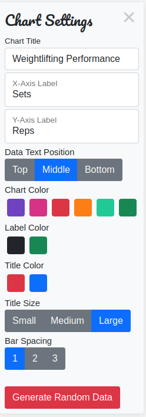
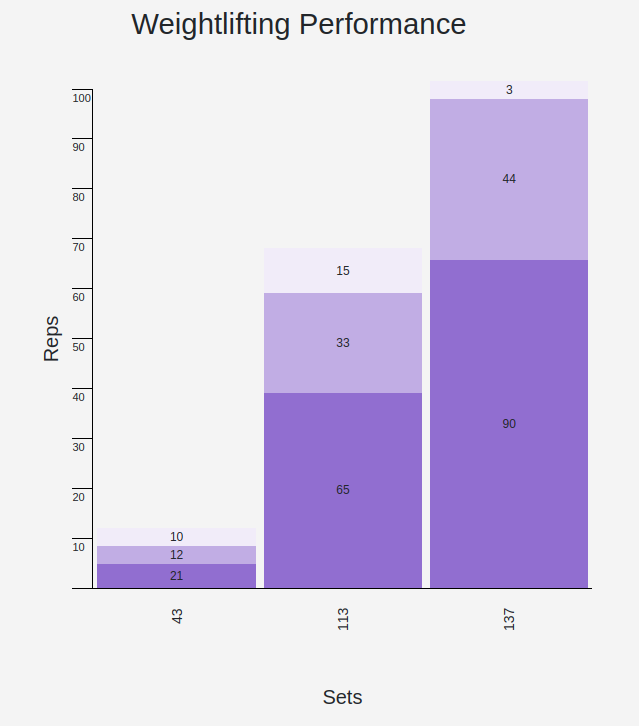

--> https://mmmbacon.github.io/lhl-bar-chart/

# About
This is a stretch project for the lighthouse labs web development course. It uses HTML, CSS, Javascript and JQuery to render a barchart to a page. I have used bootstrap to simplify the component design and layout. The chart is code uses a revealing constructor pattern and string literals to create templated and re-usable classes in JS.

# Challenges/Lessons Learned
I ideally set out on this project to create a page that had resuable jQuery components. After some initial reading up on jQuery application design, I decided the best way to design the application was using a revealing constructor pattern. This would allow me to treat each component of the chart as a 'class' in a resuable fashion - This was probably inspired by my experience with React. Lack of forward thinking and overall application structure consideration has created a problem now where my events are firing globally and I am not controlling event propagation. This results in all charts recieving events when a single button or input is changed in a chart.

# Functionality

<p>This panel appears per chart object on the page and will control chart settings. Every change on this panel is reflected on the chart in real time through custom event dispachers.</p>


<p>This example shows the X-Axis title along the bottom, the Y-Axis title on the left side of the chart, the chart title and the chart data groups. Each data group has values which are sorted in ascending orer and labeled.</p>

# API
```drawBarChart(data, {options}, component)```

```data``` [Array] Initial data set input into function.  
```{options}```[Object]
* ```title```: Title of the Chart
* ```width```: Width of the chart on the page 
* ```height```: Height of the chart on the page 
* ```xAxisTitle```: The title of the X-Axis for the data set
* ```yAxisTitle```: The title of the Y-Axis for the data set
* ```graduations```: The amount of graduations on the chart
```component```: [Object] The DOM component we are attaching the chart to
    
# Known Issues / Bugs
* Chart does not currently encapsulate events - events are triggered on all charts on the page
* Page does not scale well for very small devices
* Data values limited to 100 maximum

# Feature Roadmap
* Encapsulation improvements including controlling event propagation
* Integrate chart options panel into the chart for usability improvements
* Custom colors for each data segment

# Resources

jQuery Docs: https://api.jquery.com/
Bootstrap: https://getbootstrap.com/
Revealing Constructor Pattern: https://vanillajstoolkit.com/boilerplates/revealing-constructor/
Finding help with nested template literals (tagged template literals): https://stackoverflow.com/questions/53840093/efficient-method-of-inserting-jquery-elements-within-template-literals
